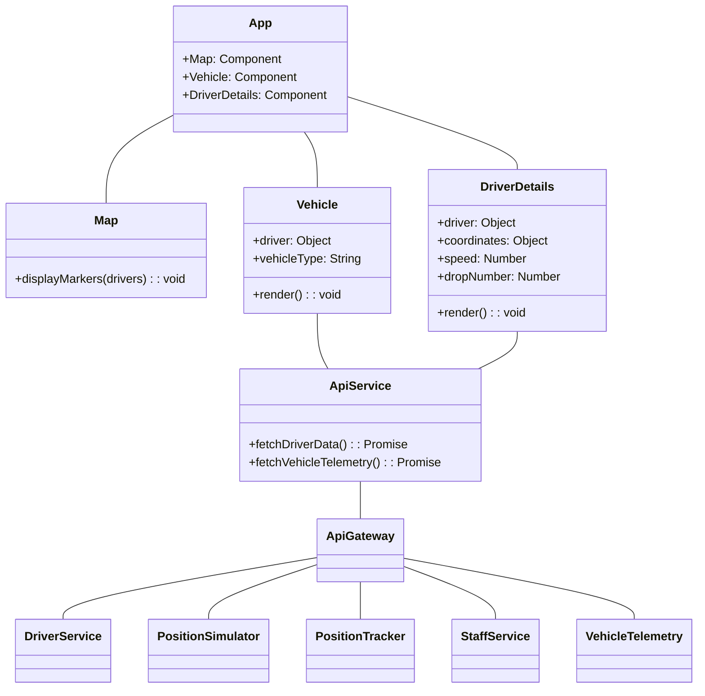

# TrackR - Vehicle Delivery Tracking Example App

TrackR is a web-based application that helps companies manage their fleet of delivery vehicles. It provides an easy way to monitor the performance of vehicles, track expenses, schedule maintenance tasks, and keep track of driver behavior.

This is a microservices application based on NodeJS, React, Kubernetes, and MySQL.

## Features

TrackR provides the following features:

- Real-time vehicle tracking
- Trip history and reports
- Driver behavior monitoring
- Fuel and expense management
- Maintenance scheduling and reminders
- Geofencing and alerts
- Driver identification and access control

Using TrackR can help companies reduce operating costs, increase efficiency, improve vehicle safety, and enhance overall fleet management. It is a user-friendly application that can be accessed from any device with an internet connection.

## Requirements

To run TrackR, you will need the following:

- Node.js 14 or higher
- MySQL 8.0 or higher
- Kubernetes 1.18 or higher

## Installation

To install TrackR, follow these steps:

1. Clone the repository: `git clone https://github.com/username/TrackR.git`
2. Install the dependencies: `npm install`
3. Configure the database connection: `cp .env.example .env` and edit the `.env` file with your database credentials
4. Start the server: `npm start`

## Usage

To use TrackR, open your web browser and go to `http://localhost:3000`. You should see the login page.

Login using the default credentials:

- Email: `admin@example.com`
- Password: `password`

Once you are logged in, you can start using TrackR.

## Components

Here is a class diagram showing the components of the TrackR application:

